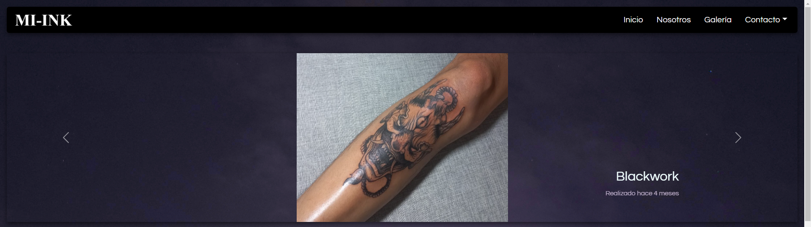
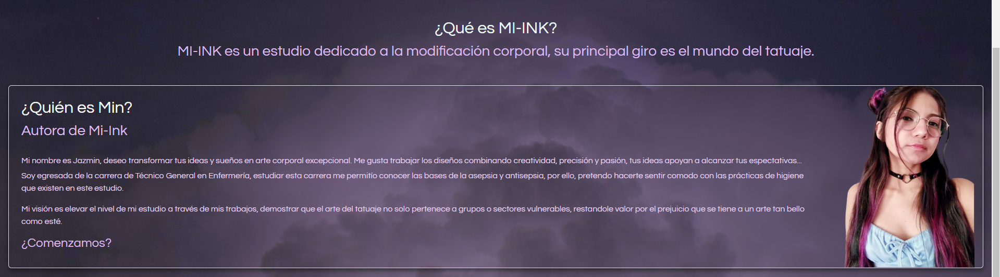
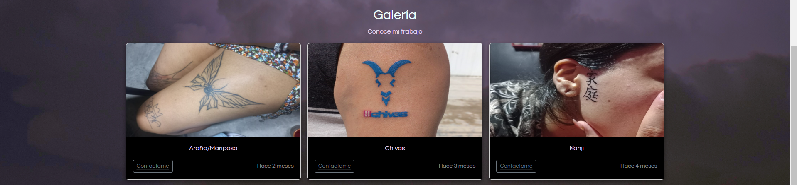
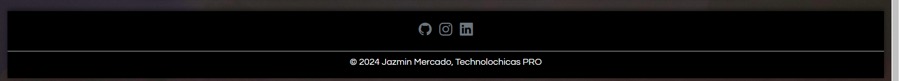

# Mi-Ink

Este proyecto es un Blog Web diseñado para darle publicidad a mi trabajo.

Fue desarrollado con HTML y CSS con el uso del framework de UI, BootStrap utilizando además bibliotecas externas.

Este proyecto es responsivo (pues se adapta a distintos tamaños de pantalla) y tambien incluye la presentación de la autora del proyecto.

Proyecto desplegado: https://mi-ink.netlify.app/

---

## Secciones de mi sitio

---

## Tecnologías

*HTML
*CSS
*BootStrap

---

## Desarollado por Jazmin Mercado en [TECHNOLOCHICAS PRO](https://tecnolochicas.mx/)
